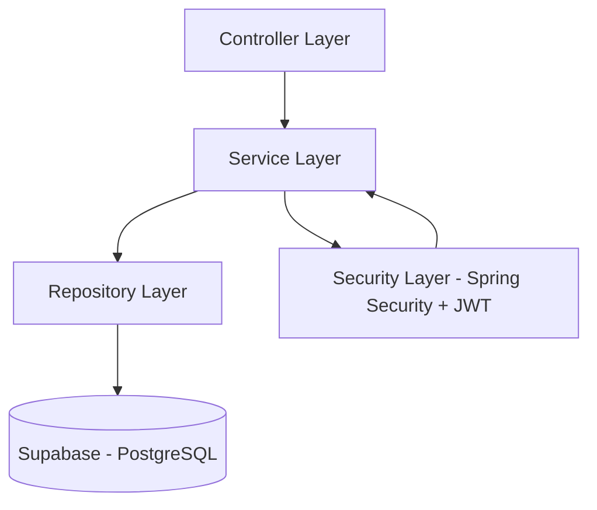

# API Catálogo de Produtos — Spring Boot, JWT e Supabase

## 1. Visão Geral do Projeto

### 1.1 O que você vai construir

Uma **API REST de catálogo de produtos** usando **Spring Boot**, com:
- Cadastro e login de usuário
- Autenticação com **JWT (JSON Web Token)**
- Perfis (roles) **USER** e **ADMIN**
- CRUD de produtos protegido (somente usuário autenticado pode acessar)
- Persistência de dados em **banco PostgreSQL do Supabase**

---

### 1.2 Tecnologias que usaremos

- **Java 17+**
- **Spring Boot 3** (Web, Data JPA, Security, Validation, Lombok)
- **PostgreSQL (Supabase)**
- **JWT** para autenticação stateless
- **Git + GitHub** (opcional, mas recomendável)
- **Insomnia ou Postman** para testar a API

---

### 1.3 Pré-requisitos recomendados

- Noções básicas de Java, HTTP e SQL
- JDK 17, IDE Java, cliente HTTP (Insomnia/Postman)

---

## 2. Arquitetura da Aplicação

A API segue uma arquitetura em camadas:
- **Controller** → recebe requisições HTTP
- **Service** → regras de negócio
- **Repository** → acesso ao banco (JPA)
- **Entity** → tabelas do banco
- **Security** → autenticação e autorização (Spring Security + JWT)



---

## 3. Configurando o Banco de Dados no Supabase

1. Crie uma conta em https://supabase.com e um novo projeto.
2. No painel, acesse **Database** e copie as informações de conexão (host, user, password, database).
3. Use a string JDBC: `jdbc:postgresql://HOST:PORT/DATABASE`

---

## 4. Configuração das Variáveis de Ambiente

No seu ambiente ou arquivo `.env`:
```
DB_URL=jdbc:postgresql://<host>:<port>/<database>
DB_USER=<usuario>
DB_PASSWORD=<senha>
JWT_SECRET=<sua-chave-secreta>
```

No `application.properties`:
```properties
spring.datasource.url=${DB_URL}
spring.datasource.username=${DB_USER}
spring.datasource.password=${DB_PASSWORD}
spring.jpa.hibernate.ddl-auto=update
spring.jpa.show-sql=true
jwt.secret=${JWT_SECRET}
jwt.expiration=3600000
```

---


## 5. Como Rodar o Projeto Passo a Passo

### 5.1 Instale o Java 17

- **macOS** (Homebrew):
  ```bash
  brew install openjdk@17
  echo 'export PATH="/opt/homebrew/opt/openjdk@17/bin:$PATH"' >> ~/.zshrc
  source ~/.zshrc
  ```
- **Windows:** Baixe o instalador do [Adoptium](https://adoptium.net/pt/temurin/releases/?version=17)
- **Linux (Ubuntu):**
  ```bash
  sudo apt update && sudo apt install openjdk-17-jdk
  ```

Verifique a instalação:
```bash
java -version
```
O resultado deve mostrar Java 17.

### 5.2 Instale o Maven

- **macOS:**
  ```bash
  brew install maven
  ```
- **Windows/Linux:** Baixe em https://maven.apache.org/download.cgi e siga as instruções.

Verifique a instalação:
```bash
mvn -v
```

### 5.3 Configure as variáveis de ambiente

Crie um arquivo `.env` na raiz do projeto ou defina as variáveis no terminal:
```
DB_URL=jdbc:postgresql://<host>:<port>/<database>
DB_USER=<usuario>
DB_PASSWORD=<senha>
JWT_SECRET=<sua-chave-secreta>
```

### 5.4 Rode o projeto

No terminal, na pasta do projeto:
```bash
mvn spring-boot:run
```

Se tudo estiver certo, a API estará disponível em:
```
http://localhost:8080
```

Você pode testar os endpoints usando o Insomnia, Postman ou qualquer cliente HTTP.

---

## 6. Exemplos de Requisições

### 6.1 Registro
`POST /auth/register`
```json
{
  "name": "João",
  "email": "joao@email.com",
  "password": "123456"
}
```
**Resposta:**
```json
{
  "token": "<jwt-token>"
}
```

### 6.2 Login
`POST /auth/login`
```json
{
  "email": "joao@email.com",
  "password": "123456"
}
```
**Resposta:**
```json
{
  "token": "<jwt-token>"
}
```

### 6.3 Listar Produtos
`GET /products`
**Headers:**
```
Authorization: Bearer <jwt-token>
```
**Resposta:**
```json
[
  { "id": 1, "title": "Produto 1", "price": 10.0 },
  { "id": 2, "title": "Produto 2", "price": 20.0 }
]
```

### 6.4 Criar Produto
`POST /products`
**Headers:**
```
Authorization: Bearer <jwt-token>
```
**Body:**
```json
{
  "title": "Produto Novo",
  "price": 99.99
}
```
**Resposta:**
```json
{
  "id": 3,
  "title": "Produto Novo",
  "price": 99.99
}
```

---

## 7. Desafios Extras (para aprofundar)

1. Implementar GET/PUT/DELETE de produtos por id
2. Criar uma role ADMIN com permissão exclusiva para criar/editar/deletar produtos
3. Adicionar paginação em GET /products
4. Integrar Swagger/OpenAPI para documentação da API
5. Criar endpoint /users/me para retornar dados do usuário logado

---

## 8. Referências para Estudo

- [Spring Boot Docs](https://spring.io/projects/spring-boot)
- [Spring Security Reference](https://spring.io/projects/spring-security)
- [JJWT (JWT lib)](https://github.com/jwtk/jjwt)
- [Supabase Docs](https://supabase.com/docs)

---

> Use este README como roteiro de estudo e consulta rápida!
- Registro e login de usuário com JWT
- CRUD básico de produtos (listar e criar)
- Proteção de rotas com autenticação JWT
- Banco de dados PostgreSQL (Supabase)

## Tecnologias Utilizadas
- Java 17
- Spring Boot 3
- Spring Web
- Spring Data JPA
- Spring Security
- Lombok
- Validation
- PostgreSQL Driver

## Estrutura do Projeto
```
src/main/java/com/example/teste1/demo/
    ├── DemoApplication.java
    ├── auth/           # Autenticação e JWT
    ├── config/         # Configurações de segurança
    ├── dto/            # DTOs
    ├── model/          # Entidades
    ├── repository/     # Repositórios
    ├── service/        # Serviços
    └── controller/     # Controllers
src/main/resources/
    └── application.properties
pom.xml
README.md
```

## Configuração do Banco de Dados (Supabase)
1. Crie um projeto no [Supabase](https://supabase.com/).
2. No painel do projeto, acesse **Project Settings > Database** e copie:
   - `DB_URL` (ex: `jdbc:postgresql://db.xxxxx.supabase.co:5432/postgres`)
   - `DB_USER`
   - `DB_PASSWORD`
3. No painel, crie as tabelas `user` e `product` (ou deixe o Spring criar automaticamente).

## Configuração das Variáveis de Ambiente
Crie um arquivo `.env` na raiz do projeto (ou defina no ambiente):
```
DB_URL=jdbc:postgresql://<host>:<port>/<database>
DB_USER=<usuario>
DB_PASSWORD=<senha>
JWT_SECRET=<sua-chave-secreta>
```

## application.properties
```properties
spring.datasource.url=${DB_URL}
spring.datasource.username=${DB_USER}
spring.datasource.password=${DB_PASSWORD}

spring.jpa.hibernate.ddl-auto=update
spring.jpa.show-sql=true

jwt.secret=${JWT_SECRET}
jwt.expiration=3600000
```

## Como Rodar
1. Instale o Java 17 e o Maven.
2. Configure as variáveis de ambiente conforme acima.
3. Execute:
```bash
mvn spring-boot:run
```

A API estará disponível em `http://localhost:8080`.

## Exemplos de Requisições

### 1. Registro
`POST /auth/register`
```json
{
  "name": "João",
  "email": "joao@email.com",
  "password": "123456"
}
```
**Resposta:**
```json
{
  "token": "<jwt-token>"
}
```

### 2. Login
`POST /auth/login`
```json
{
  "email": "joao@email.com",
  "password": "123456"
}
```
**Resposta:**
```json
{
  "token": "<jwt-token>"
}
```

### 3. Listar Produtos
`GET /products`

**Headers:**
```
Authorization: Bearer <jwt-token>
```
**Resposta:**
```json
[
  { "id": 1, "title": "Produto 1", "price": 10.0 },
  { "id": 2, "title": "Produto 2", "price": 20.0 }
]
```

### 4. Criar Produto
`POST /products`

**Headers:**
```
Authorization: Bearer <jwt-token>
```
**Body:**
```json
{
  "title": "Produto Novo",
  "price": 99.99
}
```
**Resposta:**
```json
{
  "id": 3,
  "title": "Produto Novo",
  "price": 99.99
}
```

---

## Observações
- O projeto não possui camadas ou padrões avançados.
- Foco total em didática e clareza.
- Pronto para ser expandido conforme o aprendizado.

---

Dúvidas? Abra o código, leia os comentários e experimente as requisições no Postman/Insomnia!
